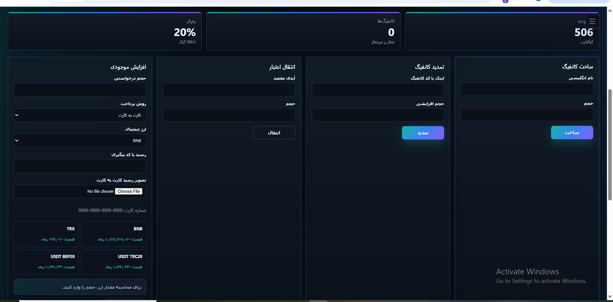
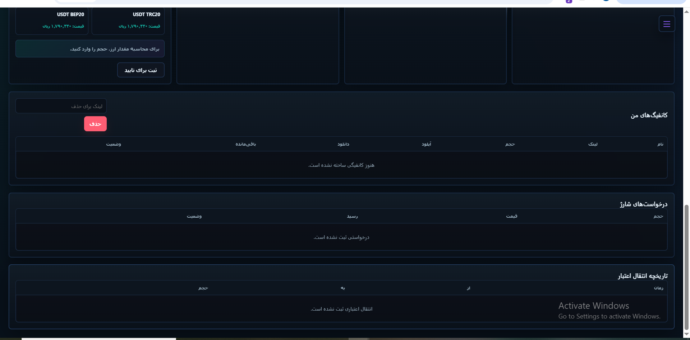
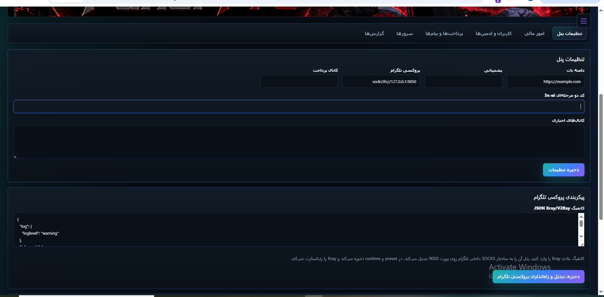
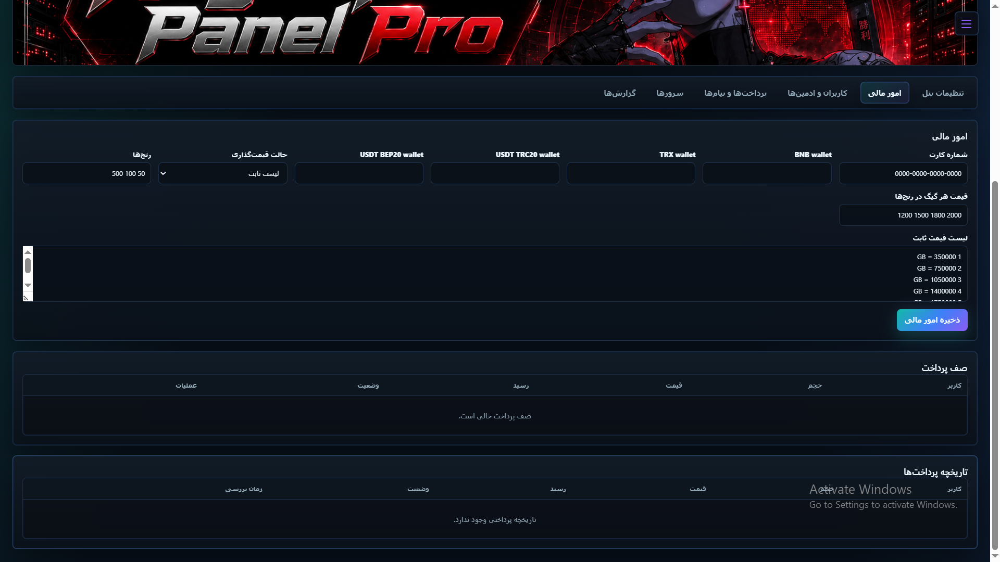
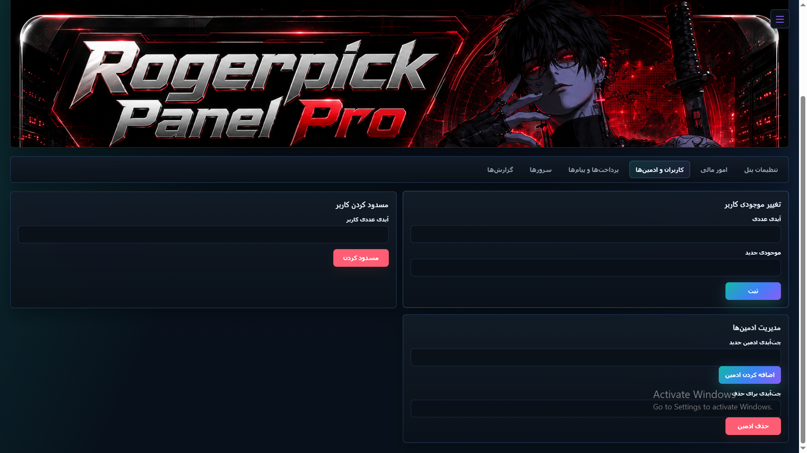
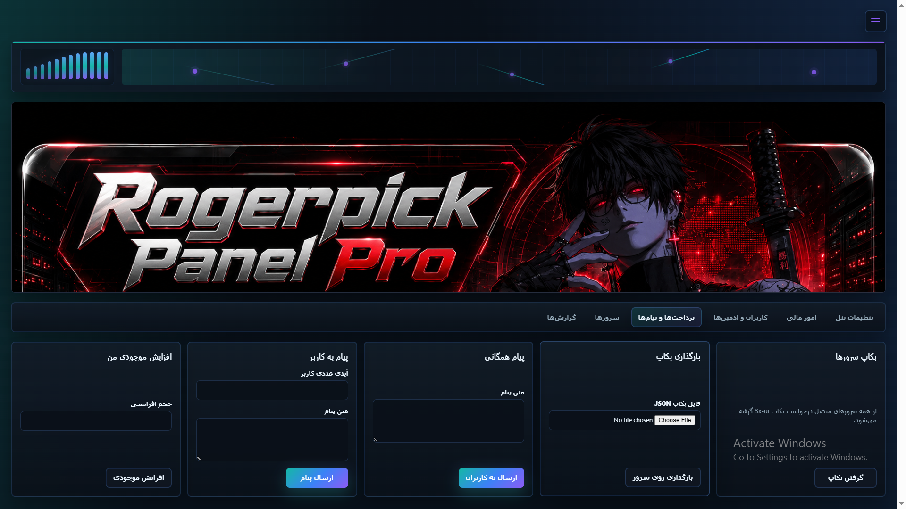
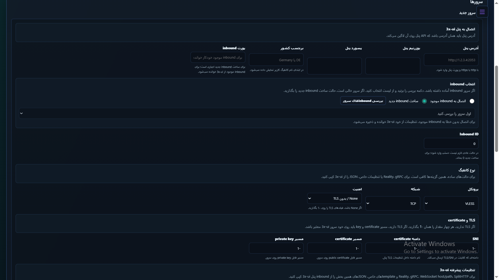
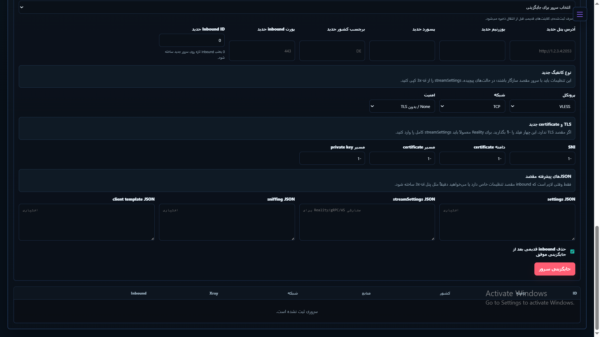

# Rogerpick Panel Pro

Rogerpick Panel Pro یک پروژه چندبخشی برای فروش، مدیریت و نگهداری اشتراک‌های مبتنی بر `3x-ui` و `V2Ray/Xray` است. این مخزن فقط یک ربات تلگرام یا یک پنل ساده نیست؛ عملا یک باندل عملیاتی کامل است که هم‌زمان این لایه‌ها را پوشش می‌دهد:

- ربات تلگرام برای کاربر نهایی و ادمین
- وب‌پنل برای کاربر، ادمین و ادمین اصلی
- لایه اتصال و اتوماسیون `3x-ui`
- دیتابیس کاربران، اشتراک‌ها، سرورها، تراکنش‌ها و صف پرداخت
- نصب آفلاین روی Ubuntu 24 با پکیج‌های محلی
- مسیر پروکسی اختصاصی برای تلگرام با `Xray`
- اسکریپت‌های اجرا، استارت/استاپ، وضعیت، systemd و setup wizard



## این پروژه دقیقا چه کاری انجام می‌دهد

هسته پروژه برای این سناریو طراحی شده است:

- ادمین چند سرور `3x-ui` را به سیستم معرفی می‌کند.
- سیستم برای هر کاربر اشتراک می‌سازد، روی چند سرور کانفیگ ایجاد می‌کند و لینک‌ها را نگه می‌دارد.
- مصرف اشتراک‌ها به‌صورت دوره‌ای بررسی می‌شود و در صورت اتمام حجم، سرویس از سمت `3x-ui` غیرفعال می‌شود.
- کاربر از طریق ربات یا وب‌پنل می‌تواند سرویس بخرد، تمدید کند، حذف کند، موجودی منتقل کند و وضعیت خود را ببیند.
- ادمین از طریق ربات یا وب‌پنل می‌تواند قیمت‌ها، سرورها، کیف پول‌ها، پیام همگانی، بکاپ و تنظیمات فروش را کنترل کند.
- اگر سرور دسترسی مستقیم به تلگرام نداشته باشد، فقط ترافیک تلگرام از داخل `Xray` عبور داده می‌شود و ارتباط‌های `3x-ui` به‌صورت مستقیم باقی می‌ماند.

## اجزای اصلی

### 1. ربات تلگرام

ربات تلگرام بخش کاربرمحور پروژه است و منوی تعاملی کامل دارد. از روی کد `project/bot.py` و `project/config.py` قابلیت‌های اصلی آن شامل این موارد است:

- خرید سرویس جدید
- خرید گروهی
- تمدید سرویس
- حذف سرویس
- مشاهده همه سرویس‌ها
- دریافت آمار و وضعیت مصرف سرویس
- شارژ کیف پول
- انتقال اعتبار بین کاربران
- مشاهده تعرفه‌ها
- تنظیم رمز ورود وب از داخل ربات
- مشاهده کاربران دعوت‌شده
- دسترسی به پنل ادمین برای ادمین‌ها
- لینک پشتیبانی

در بخش پرداخت، پروژه هم پرداخت کارت‌به‌کارت و هم پرداخت کریپتویی را در نظر گرفته است:

- پرداخت ریالی با شماره کارت
- کیف پول‌های `BNB`، `TRX`، `USDT TRC20` و `USDT BEP20`
- دریافت رسید پرداخت و ثبت آن در صف بررسی
- صف `waitlist` برای تایید/رد پرداخت توسط ادمین

### 2. وب‌پنل

فایل اصلی وب‌پنل [`project/web_panel.py`](</c:/Users/farbod/Desktop/New folder/pythonProject/v2/offline_ubuntu24_bundle/project/web_panel.py>) است. این پنل هم بخش کاربری دارد و هم بخش مدیریتی.

از روی اسکرین‌شات‌هایی که فرستادی، ساختار بصری وب‌پنل هم با همین قابلیت‌های کد هماهنگ است: صفحه ورود مجزا، داشبورد کاربر با کارت‌های آمار، فرم‌های ساخت/تمدید/انتقال/افزایش موجودی، جدول کانفیگ‌ها و درخواست‌های شارژ، و در بخش ادمین تب‌های جدا برای تنظیمات پنل، امور مالی، کاربران و ادمین‌ها، سرورها، پیام‌ها و بکاپ، و گزارش‌ها.

قابلیت‌های کاربری:

- ورود با `chat_id + password`
- نمایش اشتراک‌ها و میزان مصرف
- ساخت اشتراک جدید
- تمدید اشتراک
- حذف اشتراک
- انتقال موجودی
- شارژ حساب
- مشاهده صفحه عمومی هر اشتراک از مسیرهای `/s/<sub_link>` و `/sub/<sub_link>`

نمونه‌های بخش کاربری:




قابلیت‌های مدیریتی:

- مشاهده داشبورد کلی کاربران، اشتراک‌ها و سرورها
- تایید یا رد درخواست‌های پرداخت در `waitlist`
- شارژ موجودی کاربران
- مسدود کردن کاربر
- افزودن ادمین و حذف ادمین
- مدیریت تنظیمات عمومی
- تغییر وضعیت فروش ربات
- ارسال پیام همگانی
- ارسال پیام مستقیم به یک کاربر
- دریافت آمار فایل‌های ماهانه
- مشاهده وضعیت سرورها به‌صورت JSON و WebSocket
- آپلود بنر وب‌پنل

چیزهایی که در اسکرین‌شات‌ها مشخص‌اند و مستقیم با این قابلیت‌ها match می‌شوند:

- صفحه ورود با `chat_id` و پسورد وب
- داشبورد کاربر با نمایش موجودی، تعداد کانفیگ و رفرال
- فرم‌های ساخت کانفیگ، تمدید، انتقال اعتبار و افزایش موجودی
- نمایش لیست کانفیگ‌ها، درخواست‌های شارژ و تاریخچه انتقال اعتبار
- تب «تنظیمات پنل» برای دامنه، لینک پشتیبانی، پروکسی تلگرام، JSON مربوط به Xray/V2Ray، بنر و وضعیت فروش
- تب «امور مالی» برای شماره کارت، کیف‌پول‌های کریپتو، حالت قیمت‌گذاری و صف پرداخت
- تب «کاربران و ادمین‌ها» برای تغییر موجودی، مسدودسازی کاربر و مدیریت ادمین‌ها
- تب «پرداخت‌ها و پیام‌ها» برای پیام همگانی، پیام مستقیم و بکاپ/ریستور
- تب «سرورها» برای افزودن سرور جدید، انتخاب inbound موجود یا ساخت inbound جدید و تنظیم نوع کانفیگ
- تب «گزارش‌ها» برای آمار کاربران و گزارش انتقال اعتبار

نمونه‌های بخش مدیریتی:









مسیرهای اصلی پنل از روی کد:

- `/login`
- `/logout`
- `/`
- `/crypto/prices.json`
- `/subscriptions/create`
- `/subscriptions/extend`
- `/subscriptions/delete`
- `/balance/transfer`
- `/balance/charge`
- `/admin`
- `/admin/servers/status.json`
- مجموعه کامل `POST` برای مدیریت سرورها، ادمین‌ها، پرداخت‌ها، تنظیمات، بکاپ و پروکسی تلگرام

### 3. لایه مدیریت `3x-ui`

بخش مهمی از منطق پروژه در [`project/config.py`](</c:/Users/farbod/Desktop/New folder/pythonProject/v2/offline_ubuntu24_bundle/project/config.py>) و [`project/web_panel.py`](</c:/Users/farbod/Desktop/New folder/pythonProject/v2/offline_ubuntu24_bundle/project/web_panel.py>) مربوط به اتصال به `3x-ui` است.

قابلیت‌های این لایه:

- لاگین به پنل `3x-ui`
- پشتیبانی از `twoFactorCode`
- ساخت کلاینت
- افزودن کلاینت به inbound
- ویرایش و غیرفعال/فعال‌سازی کلاینت
- حذف کلاینت
- ساخت inbound جدید
- حذف inbound
- خواندن لیست inboundها
- کشف inboundهای موجود
- ساخت لینک اشتراک برای کاربر
- خواندن وضعیت سرور
- ری‌استارت `Xray`
- جایگزینی کامل یک سرور با سرور جدید

پروژه فقط اطلاعات ساده سرور را نگه نمی‌دارد؛ برای هر سرور این داده‌ها هم پشتیبانی می‌شود:

- `protocol`
- `network`
- `security`
- `inbound_settings_json`
- `stream_settings_json`
- `sniffing_json`
- `client_template_json`

یعنی ساختار پروژه برای سرورهای ساده محدود نشده و امکان نگهداری قالب‌های دقیق‌تر inbound/client را هم دارد.

نمونه‌های مدیریت سرور:





### 4. مانیتورینگ اشتراک‌ها

فایل [`project/cronjob.py`](</c:/Users/farbod/Desktop/New folder/pythonProject/v2/offline_ubuntu24_bundle/project/cronjob.py>) هر 30 ثانیه تابع بررسی اشتراک‌ها را اجرا می‌کند.

بر اساس `check_subscriptions()` در `config.py`:

- همه اشتراک‌ها بررسی می‌شوند.
- مجموع ترافیک مصرفی محاسبه می‌شود.
- اگر مصرف از حجم خریداری‌شده عبور کند، اشتراک غیرفعال می‌شود.
- غیرفعال‌سازی روی خود `3x-ui` هم اعمال می‌شود.
- وضعیت آخر مانیتورینگ در `project/runtime/subscription_monitor_status.json` ثبت می‌شود.

این یعنی پروژه فقط CRUD انجام نمی‌دهد و یک حلقه نگهداری عملیاتی هم دارد.

### 5. قیمت‌گذاری و مالی

سیستم قیمت‌گذاری پروژه دو حالت دارد:

- `range`: قیمت‌گذاری پلکانی بر اساس بازه حجم
- `fixed`: لیست قیمت ثابت برای حجم‌های مشخص

از روی `web_panel_settings.example.json` و منطق کد، تنظیمات مالی شامل این موارد است:

- `ranges`
- `prices`
- `fixed_prices`
- `referral_percent`
- `referral_rate`
- `card_num`
- `crypto_wallets`
- `payment_channel_chat_id`

همچنین در وب‌پنل قیمت کریپتو از چند منبع دریافت می‌شود:

- `Nobitex`
- `Wallex`
- `CoinGecko`

پس پروژه برای فروش فقط به قیمت ثابت دستی متکی نیست و منطق quote کریپتویی هم دارد.

### 6. بکاپ و بازیابی

بخش بکاپ یکی از نقاط قوی پروژه است. این سیستم فقط یک endpoint ساده را صدا نمی‌زند، بلکه چند fallback دارد:

- تلاش برای دریافت بکاپ دیتابیس از `3x-ui`
- تلاش برای endpointهای بکاپ inbound
- تلاش برای بکاپ تلگرامی `3x-ui`
- و اگر هیچ‌کدام فایل قابل دانلود ندهند، ساخت `manual_3xui_backup`

در حالت بکاپ دستی، این داده‌ها ذخیره می‌شوند:

- `inbounds`
- `server_status`
- آدرس مبدا
- زمان ساخت بکاپ

وب‌پنل می‌تواند:

- از همه سرورها بکاپ بگیرد
- فایل ZIP بکاپ‌ها را تحویل دهد
- بکاپ آپلودشده را ریستور کند

### 7. پروکسی اختصاصی تلگرام

یکی از مهم‌ترین ویژگی‌های معماری پروژه، جداسازی مسیر شبکه تلگرام از مسیر ارتباط با سرورهای `3x-ui` است. این منطق در [`project/networking.py`](</c:/Users/farbod/Desktop/New folder/pythonProject/v2/offline_ubuntu24_bundle/project/networking.py>) و `setup_wizard.py` پیاده‌سازی شده است.

این بخش چه می‌کند:

- فقط درخواست‌های `api.telegram.org` را از پروکسی عبور می‌دهد
- برای تلگرام می‌تواند IP DNS را override کند
- درخواست‌های عادی `requests` برای سرورهای `3x-ui` را مستقیم نگه می‌دارد
- روی `socks5h://127.0.0.1:9050` سوار می‌شود
- از JSON خام `Xray/V2Ray` یا `vless://...` کانفیگ قابل اجرا می‌سازد
- کانفیگ WebSocket و TLS را normalize می‌کند
- سلامت پروکسی عمومی و Telegram API را تست می‌کند

این تصمیم معماری مهم است چون جلوگیری می‌کند که تمام درخواست‌های مدیریتی سرور از همان مسیر پروکسی تلگرام عبور کنند.

## ساختار فایل‌ها

فایل‌های مهم پروژه و نقش هرکدام:

- [`project/bot.py`](</c:/Users/farbod/Desktop/New folder/pythonProject/v2/offline_ubuntu24_bundle/project/bot.py>): نقطه شروع ربات و هندلرهای callback/message
- [`project/config.py`](</c:/Users/farbod/Desktop/New folder/pythonProject/v2/offline_ubuntu24_bundle/project/config.py>): منطق اصلی کسب‌وکار، قیمت‌گذاری، اشتراک‌ها، سرورها، بکاپ و مانیتورینگ
- [`project/web_panel.py`](</c:/Users/farbod/Desktop/New folder/pythonProject/v2/offline_ubuntu24_bundle/project/web_panel.py>): وب‌پنل Flask
- [`project/database.py`](</c:/Users/farbod/Desktop/New folder/pythonProject/v2/offline_ubuntu24_bundle/project/database.py>): مدل‌های SQLAlchemy و migrationهای سبک درون‌کدی
- [`project/app_settings.py`](</c:/Users/farbod/Desktop/New folder/pythonProject/v2/offline_ubuntu24_bundle/project/app_settings.py>): لود/ذخیره تنظیمات از JSON و environment
- [`project/networking.py`](</c:/Users/farbod/Desktop/New folder/pythonProject/v2/offline_ubuntu24_bundle/project/networking.py>): تفکیک شبکه تلگرام و شبکه مستقیم
- [`project/cronjob.py`](</c:/Users/farbod/Desktop/New folder/pythonProject/v2/offline_ubuntu24_bundle/project/cronjob.py>): چک دوره‌ای اشتراک‌ها
- [`setup_wizard.py`](</c:/Users/farbod/Desktop/New folder/pythonProject/v2/offline_ubuntu24_bundle/setup_wizard.py>): ویزارد راه‌اندازی اولیه
- [`install_offline.sh`](</c:/Users/farbod/Desktop/New folder/pythonProject/v2/offline_ubuntu24_bundle/install_offline.sh>): نصب آفلاین dependencyها از `wheels/`
- [`scripts/install_systemd_services.sh`](</c:/Users/farbod/Desktop/New folder/pythonProject/v2/offline_ubuntu24_bundle/scripts/install_systemd_services.sh>): ساخت سرویس‌های systemd
- [`scripts/start_all.sh`](</c:/Users/farbod/Desktop/New folder/pythonProject/v2/offline_ubuntu24_bundle/scripts/start_all.sh>): استارت سرویس‌ها
- [`scripts/stop_all.sh`](</c:/Users/farbod/Desktop/New folder/pythonProject/v2/offline_ubuntu24_bundle/scripts/stop_all.sh>): توقف سرویس‌ها
- [`scripts/status.sh`](</c:/Users/farbod/Desktop/New folder/pythonProject/v2/offline_ubuntu24_bundle/scripts/status.sh>): نمایش وضعیت سرویس‌ها
- [`scripts/start_xray.sh`](</c:/Users/farbod/Desktop/New folder/pythonProject/v2/offline_ubuntu24_bundle/scripts/start_xray.sh>): اجرای Xray محلی

فایل‌هایی که نقش فرعی یا کمکی دارند:

- [`project/web_panel_preview.py`](</c:/Users/farbod/Desktop/New folder/pythonProject/v2/offline_ubuntu24_bundle/project/web_panel_preview.py>): پیش‌نمایش UI با داده آزمایشی
- [`project/web.py`](</c:/Users/farbod/Desktop/New folder/pythonProject/v2/offline_ubuntu24_bundle/project/web.py>): نسخه قدیمی‌تر/سبک‌تر صفحه اشتراک
- [`project/reset_database.py`](</c:/Users/farbod/Desktop/New folder/pythonProject/v2/offline_ubuntu24_bundle/project/reset_database.py>): حذف و ساخت مجدد جداول دیتابیس

## مدل داده

مدل‌های اصلی دیتابیس در `project/database.py`:

- `User`
- `Subscription`
- `Config`
- `Server`
- `Waitlist`
- `BalanceTransfer`

رابطه‌ها به‌صورت خلاصه:

- هر `User` می‌تواند چند `Subscription` داشته باشد.
- هر `Subscription` می‌تواند چند `Config` روی سرورهای مختلف داشته باشد.
- هر `Config` به یک `Server` وصل است.
- `Waitlist` صف درخواست‌های شارژ و رسید پرداخت است.
- `BalanceTransfer` تاریخچه انتقال اعتبار بین کاربران را نگه می‌دارد.

## نقش‌ها و دسترسی

سیستم نقش‌ها سه‌سطحی است:

- `user`
- `admin`
- `main_admin`

همچنین `primary_owner_chat_id` و `main_admin_chat_ids` در چند بخش حساس استفاده می‌شوند. بخشی از شناسه‌های ادمین در خروجی عمومی مخفی نگه داشته می‌شوند و بخشی از عملیات فقط برای ادمین اصلی فعال است.

## تنظیمات

تنظیمات اصلی در فایل `project/web_panel_settings.json` قرار می‌گیرد و نمونه عمومی آن در [`project/web_panel_settings.example.json`](</c:/Users/farbod/Desktop/New folder/pythonProject/v2/offline_ubuntu24_bundle/project/web_panel_settings.example.json>) است.

فیلدهای مهم تنظیمات:

- `panel_secret`
- `database_url`
- `admin_web_password`
- `bot_domain`
- `bot_token`
- `telegram_proxy_url`
- `telegram_api_ip`
- `xui_two_factor_code`
- `support_link`
- `primary_owner_chat_id`
- `main_admin_chat_ids`
- `admin_chat_ids`
- `channels`
- `card_num`
- `crypto_wallets`
- `referral_percent`
- `referral_rate`
- `pricing_mode`
- `ranges`
- `prices`
- `fixed_prices`
- `payment_channel_chat_id`
- `xray_auto_restart`
- `web_banner_path`

## استقرار آفلاین

این ریپو برای استقرار آفلاین آماده شده است:

- `wheels/` شامل پکیج‌های پایتون مورد نیاز است.
- `xray/` شامل runtime و presetهای مورد نیاز است.
- `install_offline.sh` فقط از wheelهای محلی استفاده می‌کند.
- `setup.sh` و `setup_wizard.py` کل فرآیند نصب و راه‌اندازی اولیه را ساده می‌کنند.

شروع سریع:

```bash
chmod +x setup.sh
SETUP_PORT=18080 ./setup.sh
```

سپس:

```text
http://SERVER_IP:18080
```

در setup wizard این موارد گرفته می‌شود:

- توکن ربات
- chat id ادمین اصلی
- پسورد وب ادمین
- کانفیگ Xray/VLESS برای دسترسی تلگرام

## اجرای سرویس‌ها

پروژه دو حالت اجرا دارد:

- با `systemd`
- با `nohup` و PID file

سرویس‌های اصلی:

- `nr-vpn-bot`
- `nr-vpn-web-panel`
- `nr-vpn-cronjob`
- `nr-vpn-xray`

اسکریپت‌های اصلی:

```bash
./scripts/install_xray_offline.sh
./install_offline.sh
sudo ./scripts/install_systemd_services.sh
./scripts/start_xray.sh
./scripts/start_all.sh
./scripts/status.sh
./scripts/stop_all.sh
```

## نکات مهم

- فایل واقعی `project/web_panel_settings.json` باید خصوصی بماند.
- `project/bot_panel.db` و `project/logs/` نباید commit شوند.
- `xray/runtime/config.json` در `.gitignore` قرار دارد چون فایل runtime واقعی است.
- `project/reset_database.py` مخرب است و همه جدول‌ها را دوباره می‌سازد.
- `project/web.py` فایل اصلی پنل جدید نیست؛ پنل اصلی پروژه `project/web_panel.py` است.

## اسناد تکمیلی

- [`README_OFFLINE_UBUNTU24.md`](</c:/Users/farbod/Desktop/New folder/pythonProject/v2/offline_ubuntu24_bundle/README_OFFLINE_UBUNTU24.md>): راه‌اندازی آفلاین روی Ubuntu 24
- [`SERVER_RUN_COMMANDS.md`](</c:/Users/farbod/Desktop/New folder/pythonProject/v2/offline_ubuntu24_bundle/SERVER_RUN_COMMANDS.md>): دستورات روزمره سرور
- [`RELEASE_CHECKLIST.md`](</c:/Users/farbod/Desktop/New folder/pythonProject/v2/offline_ubuntu24_bundle/RELEASE_CHECKLIST.md>): چک‌لیست انتشار
